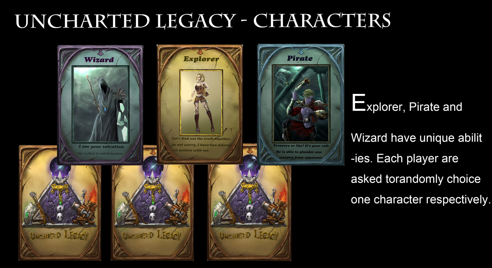
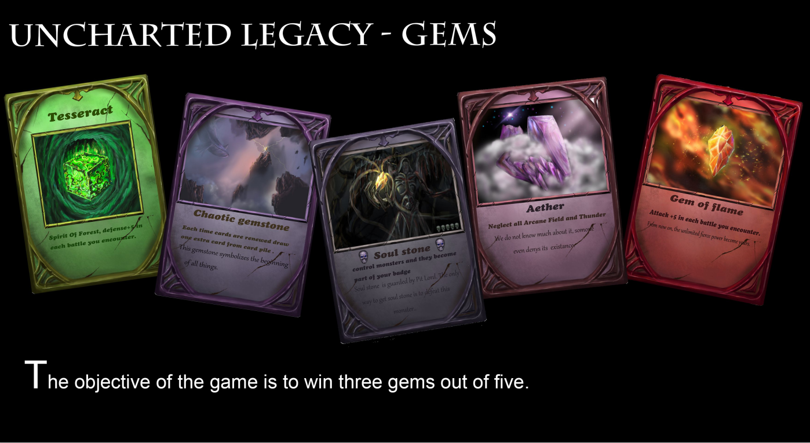
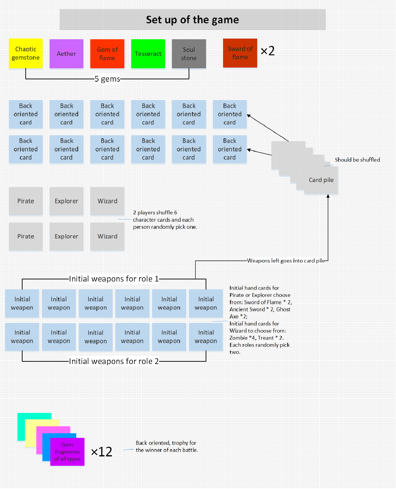
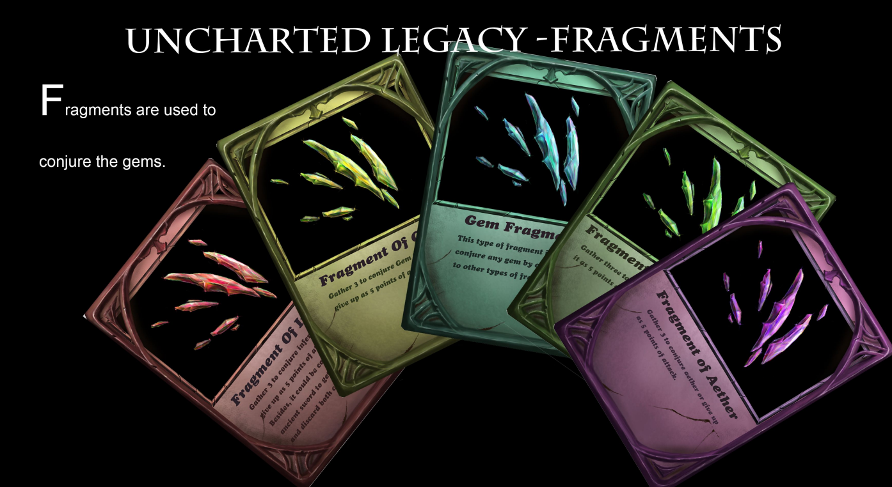
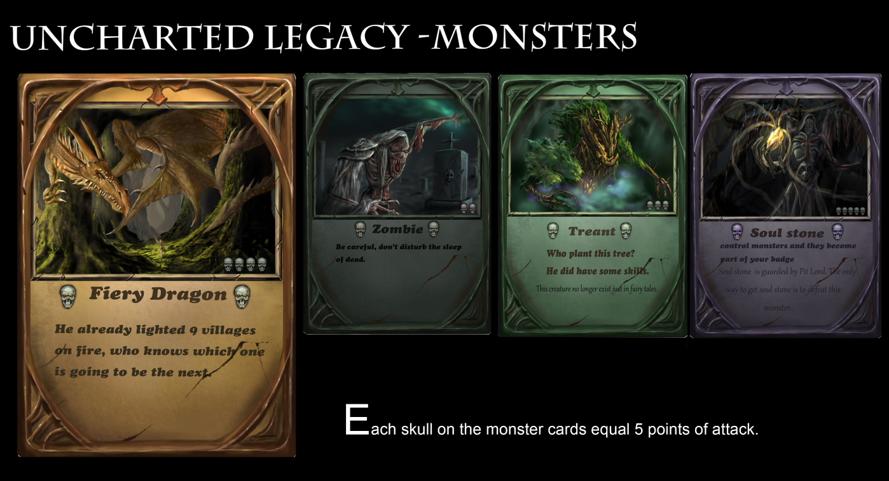
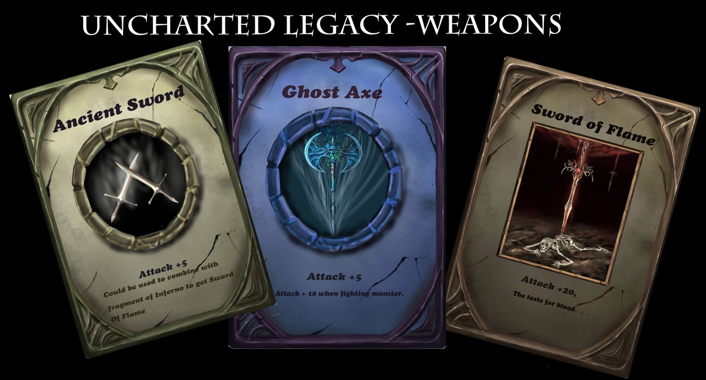
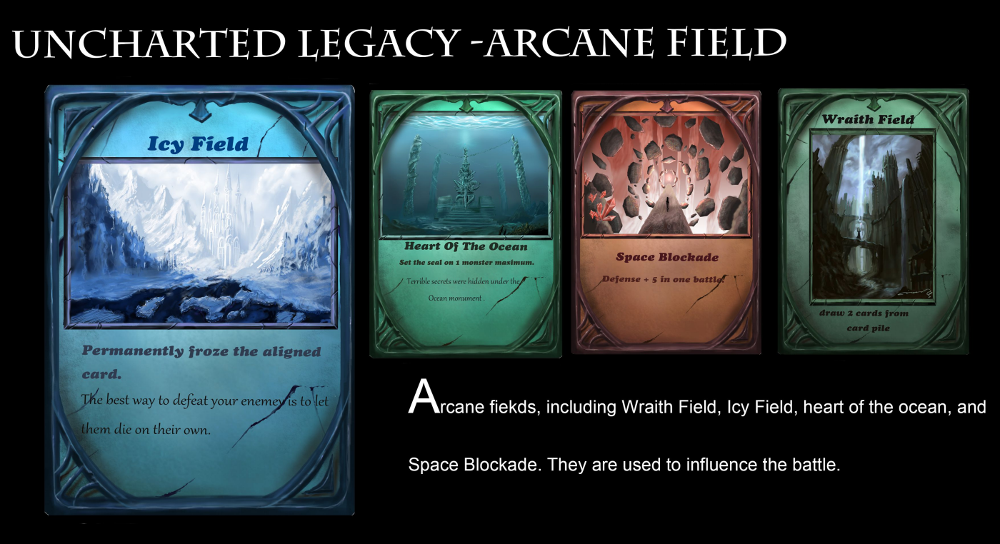
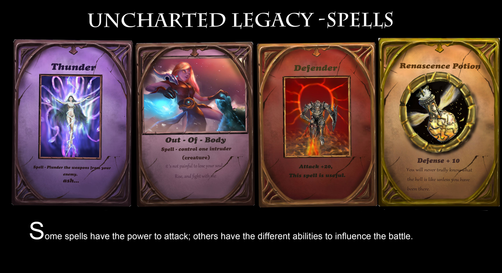

# Uncharted Legacy
Uncharted Legacy is a fantasy card game for 2 players.
The game took me nearly 2 years to complete. I built everything from scratch by designing game rules and using Photoshop to draw the digital paintings. 
I am super excited to show it to you. Hope you all like it!

## Personal Infos
- Freelance Artist, doing art just for fun
- online art portfolio: https://www.artstation.com/jianlanding7
- Have 3 years digital painting experience using Photoshop
- Trained traditional artist: good at oil painting, acrylic painting and watercolor
- Good at making illustration
- Love to share my thought to the world by using art and express my feelings using art
- Logical and creative, good at designing game rules
- Love to play video games, board games and card games
- Continuously collected player feedback to make improvements of user experience and balance the gameplay 

## Game Background
In fable place of crisis – ridden with death, that swallows all lives who dare to step in, an ancient folklore exists. It says that there are five types of fragments 
of five arcane hidden gems, which store the unlimited fierce power. The Explorer, Pirate and Wizard, who come from different parts of the world and claimed to find 
the uncharted legacy. They see each other as enemies and the only way to defeat the other is to hold three gems out of five. 

       

## Game System & Objectives
At the beginning of the game, each player randomly chooses one Character from card pile. (Pirate and Explorer have their own initial weapons but the wizard does have 
his own monsters to start with) Place 12 back-oriented cards on the table in two rows; the number in each row is 1, 2, 3, 4, 5, and 6 respectively. As the cards are 
flipped, the aligned cards create a conflict. The person who wins one conflict would obtain fragments from the pile of fragments. The goal is to win 3 gems out of five.
- 	The same cards have the power to nullify one another.
- 	The winner of each fight would use the difference of strengths divided by 5 and take that number of fragments from pile of fragments.   
- 	When only six cards left on the table, new back-oriented cards would fill the gaps.
- 	The player who has 3 gems out of 5 would win the game and capture the relic. If not, a draw would be the result.
- 	After all the cards are distributed, an evitable battle would activate.
- 	Pirate and Explore have to defeat the monster once they have encountered, followed by battle with rivalry (may or may not). Wizard has to give up 5 points 
      in order to domesticate monsters, or give up the card – no need to fight.
- 	Explorer: she has two potions with her before entering battle each with 10 points of defense.
- 	Pirate: he has ability to plunder one weapon from his opponent (weapon only)
- 	Wizard: he has to give up 5 points each time he find a monster (not include initiative weapons) in order to domesticate monsters.
- 	When two players are fighting, always calculate sum of points of attack and points of defense. Spells is instantaneous attack.

## Game Set-ups

1.	Place 5 gem stone on the side of the desk (Tesseract, Gem of flame, Aether, Chaotic gemstone and soul stone, they cannot stay inside the card pile). 
      Use 4 same types of fragments to conjure corresponding gemstone and first come first serve. Moreover, soul stone could obtain only by giving up 30 points of 
      attack.
2.	Prepare cards pile of 12 fragments (they are trophy for winner of the battles) and make sure they are in random order.
3.	Prepare initiative hand cards (Out-Of-Body *1 for Pirate and Explorer) Explorer and Pirate would select 2 out of 6 cards from their initiative weapons piles 
      (Ancient Sword*2, Ghost axe*2 and Sword of Flame*2) Wizard would select two out of 6 cards from monster piles (Treant*4 and Zombie*2) 
4.	Set two of Sword of Flame beside, could obtain by composing inferno fragments and ancient sword.
5.	Players randomly pick up a character card from pile. Secondly, shuffled rest of the card pile.
6.	Place 12 back-oriented cards on the table in two rows; the number of the each card in a row is 1, 2, 3, 4, 5 and 6 respectively. If the cards flipped lined up 
      in a turn, and then the conflict will start. The person who wins the conflict would take fragments from fragments card pile as trophy. New cards will fill the 
      gaps if only 6 cards left on the table.
7.	Special case: if there is no card left in the card pile but no one gather 3 gem stone, an inevitable battle would activated.

## Game Components
  
  
  
  
  
  
  
